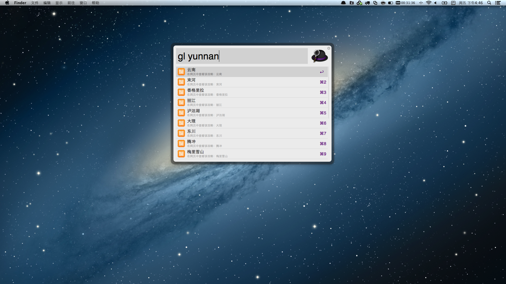

TravelGuideSearch
=================

TravelGuideSearch是为Alfred开发的一款workflow，主要功能是检索蚂蜂窝网站的旅游攻略。

[蚂蜂窝][1]是国内最大的旅游社区之一，蚂蜂窝旅游攻略已覆盖全球 343 个地区 112 个品类。已有 13697736 位蜂蜂的旅行从这里开始，旅游攻略是你出行前必须准备的功课。

Alfred是OS X最常用的一款增强型工具软件，充分利用了OS X的系统特性，帮助用户通过快捷键完成各种常用操作，属于Mac必备软件。近期Alfred发布了V2，对原有特性进行了增强和完善，并推出了全新的workflow功能，提供了极为简洁的接口和各种Action，帮助用户定制自己的功能。

更多关于Alfred的使用强烈推荐池建强的文章：[神兵利器——Alfred](http://macshuo.com/?p=625)

# Development
Alfred 2的workflow提供了多种实现方式，比如shell、php、perl、python、ruby和applescript。
SNSearch是基于Python2.7和Shell构建的。

# Requirements
* Python2.7 （OS X 10.8默认的Python版本）
* Alfred 2（付费版）

# Installation
下载TravelGuideSearch.alfredworkflow，双击导入Alfred 2即可。

# How to use
* 通过option+space呼出Alfred，输入gl  (两个空格)，查看所有的攻略。
* 输入“gl 查询关键字”，可以按照关键词进行检索，关键词大小写模糊匹配。
* 选中文章后回车可以直接用浏览器打开攻略详细。

[1]: http://www.mafengwo.cn